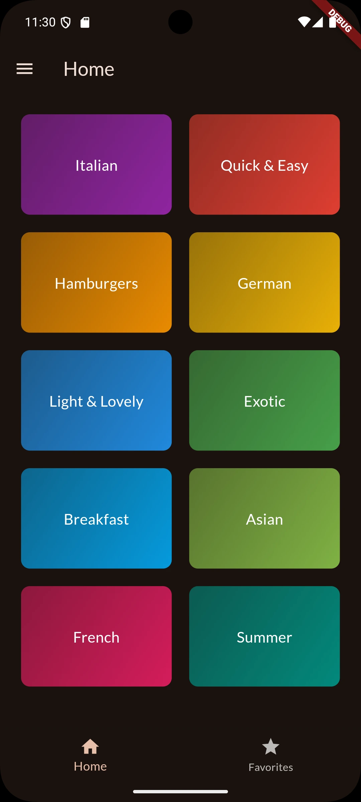
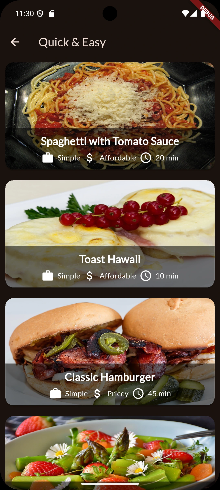
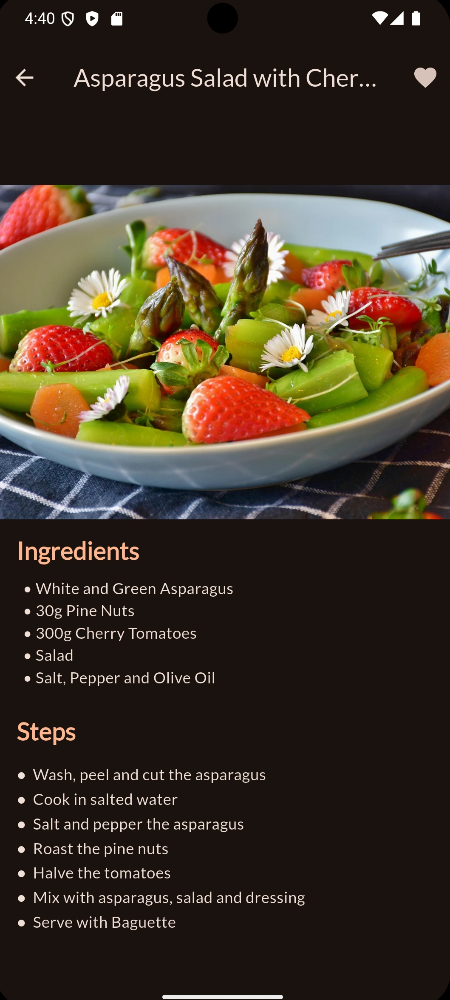
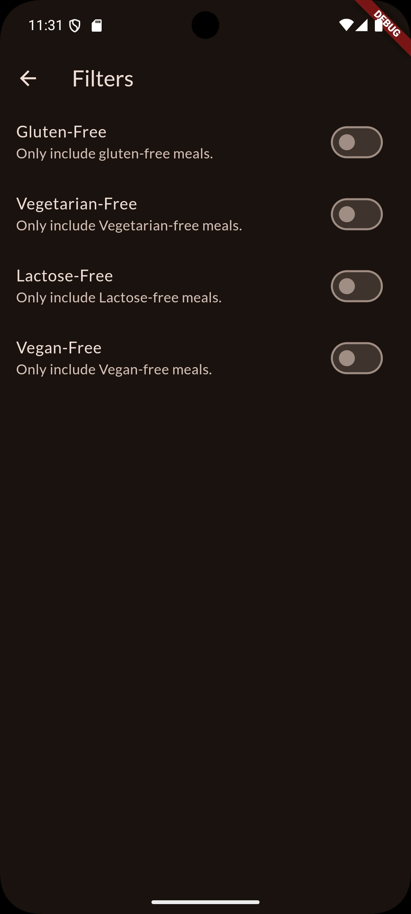
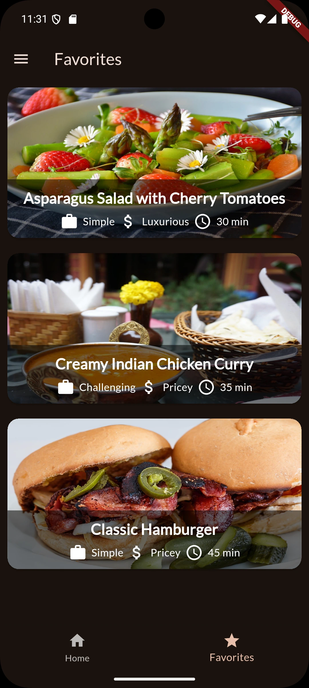

# Meals
## Introduction
Meals is a Restaurant Menu, Mobile Application that supports both iOS and Android. It dynamically creates categories and meal items, based on the data that have been provided to it. It's very easy and simple to use!

## Features
It has many features, which include;
Marking a meal as Favourite. Once a Meal is Added as Favourite, users will be able to see it from the Home Screen's Navigation Bar.
Further more, Users have the ablitiy to add Filters, to remove meals that they might not be interested in, such as Vegan or Lactose Free Meals.

The App is also fully scrollable, so you can add as many categories, meals and details as you want!  
Animations have also been added, for smooth movements.

## Fast, Efficient and Light-Weight
State Management has been well maintained throughout the app, to make it fast and efficient. Images load from url, to reduce the app's size.

## How to Add my Data?
All you have to do is, navigate to the lib/data/data.dart file. Add your categories, meals and its details. The app will dynamically create all the screens and navigations for you!

## Screenshots
&nbsp;
&nbsp;
&nbsp;
&nbsp;
&nbsp;
