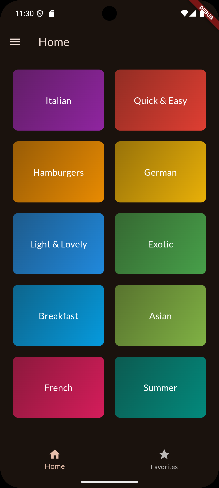
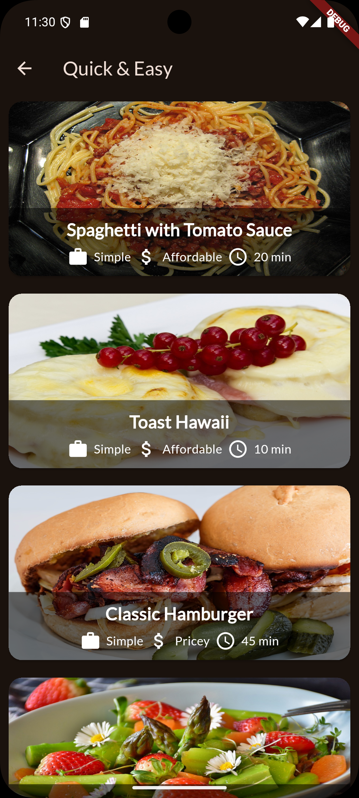
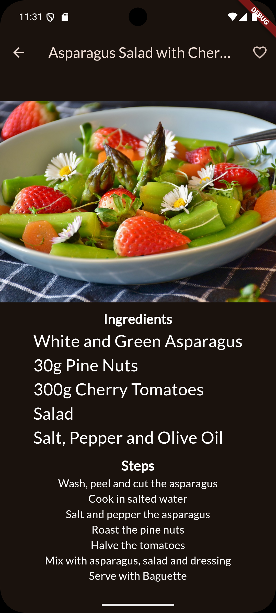
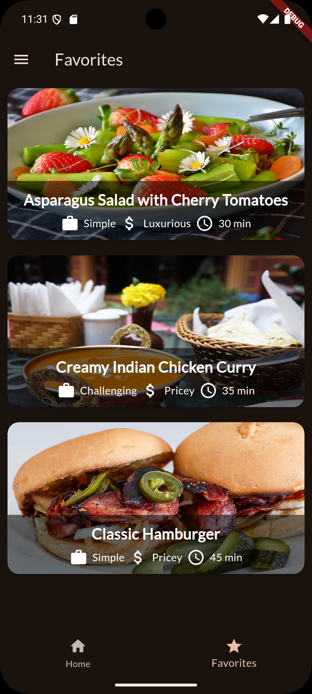
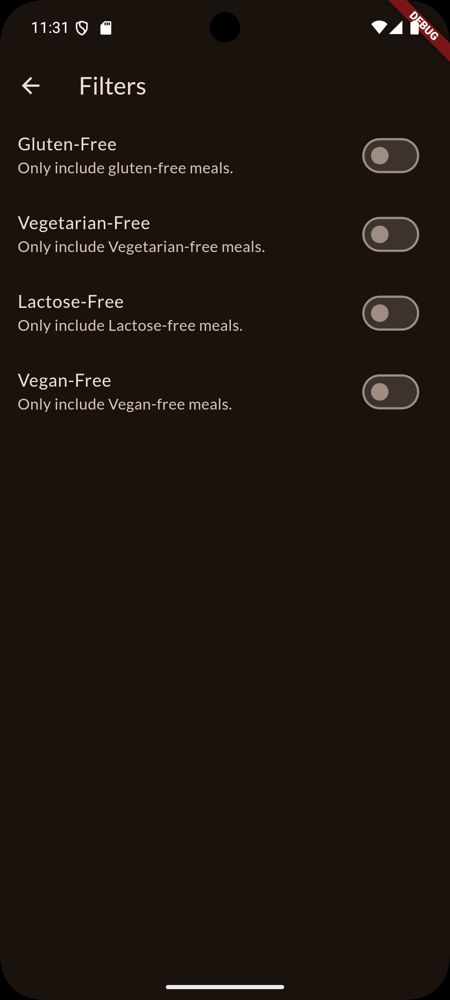

# Introduction
Meals App lets you add different category food items into your app. Its very simple to use. You can just add some details about the food item, and this app will dynamically create categories for it,
along with displaying them in an attractive way.

## Features
When a Meal is added, its specific category will be shown, once clicked, it will take you to all the meals in that category, then one a meal is picked from them, it will give you
full detail about that specific meal.
 
Filter is added to let you remove meals, you might not be interested in. Therefore only options you like are shown.
 
There is also a Favourite screen, which lets you see all meals from any category to be added there. So you can refer there anytime.

## Use Cases
This app can be used in restaurants, to showcase their menu to the user!
It can also be used by Chef to reveal all the food options available!

## ScreenShots
 &nbsp; 
 &nbsp; 

